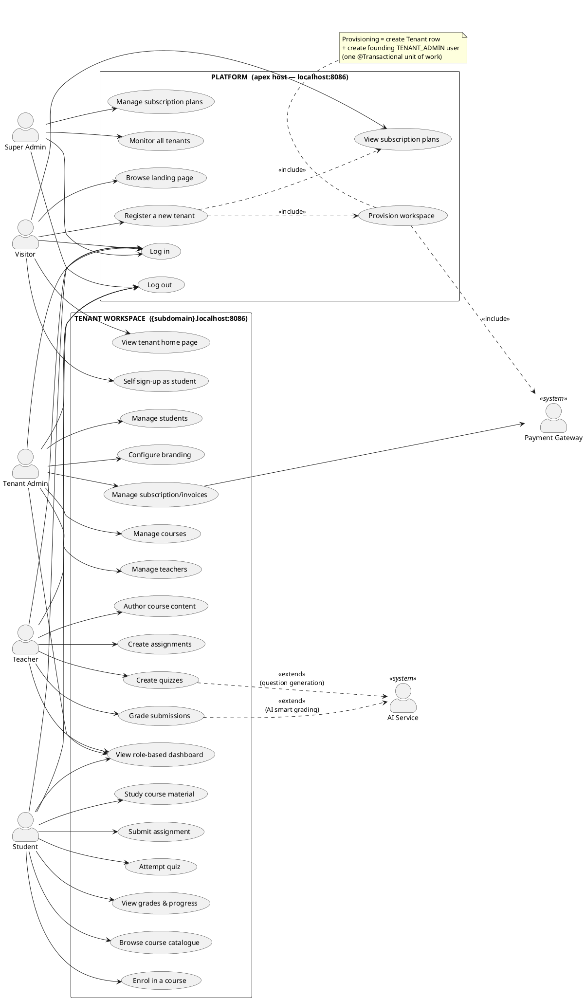
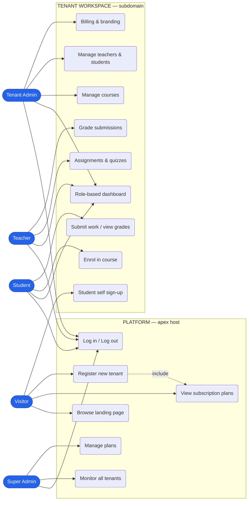
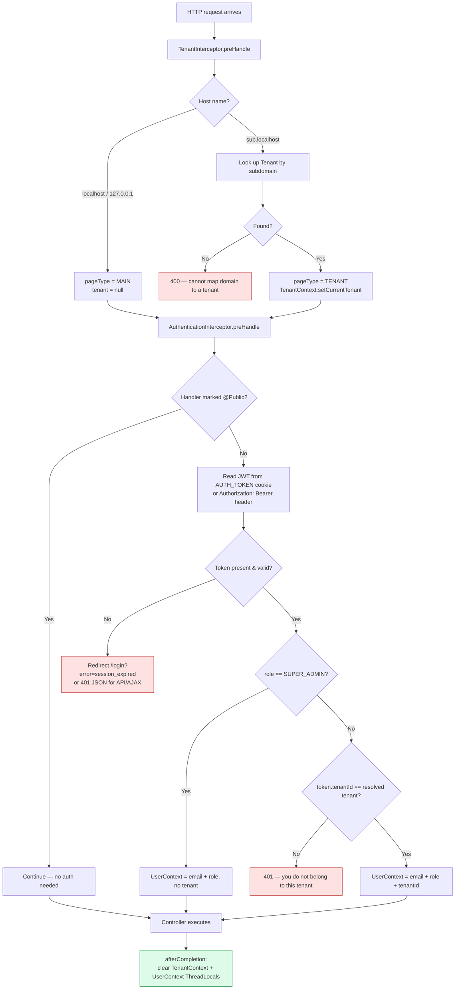
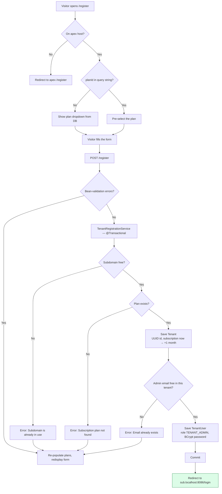
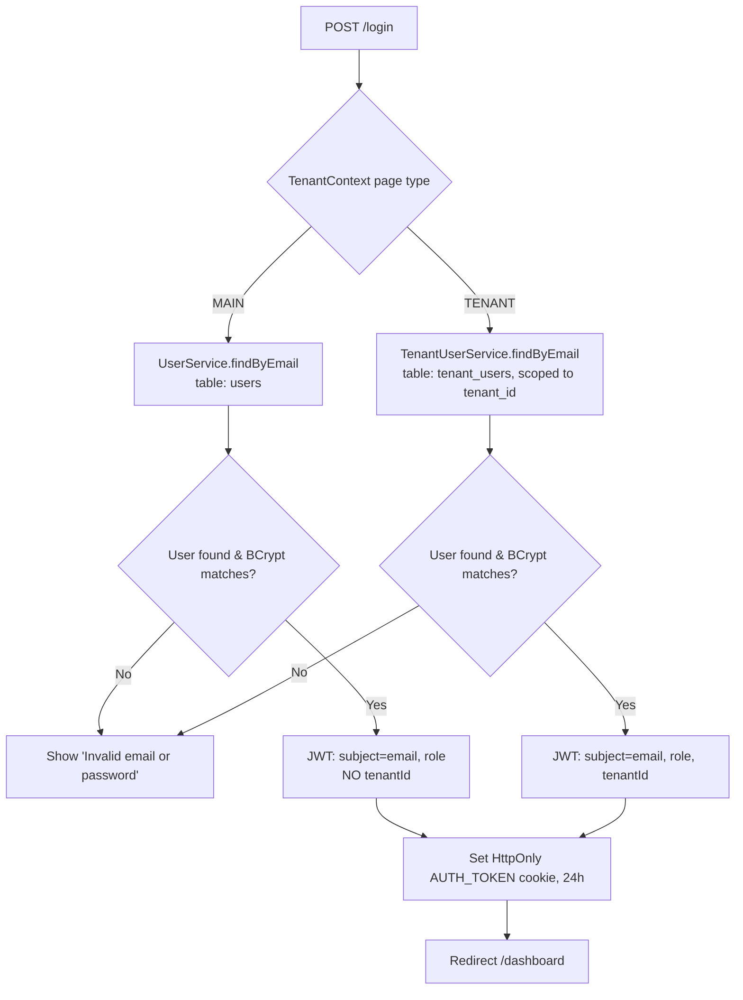
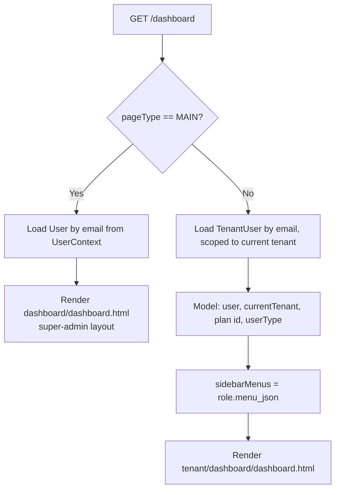

# toplms — Use Case Model (Actors & Activities)

Presentation support document for **toplms**, a multi-tenant SaaS Learning
Management System built on Spring Boot 4.

| | |
| --- | --- |
| **Document** | Use Case Model — actors, use cases, activity flows |
| **Project** | toplms (Multi-tenant LMS SaaS) |
| **Version** | Draft 1.0 — 2026-08-05 |
| **Scope note** | Marked ✅ *Implemented* / 🟡 *Partial* / ⬜ *Planned* against the code as it exists today |

---

## 1. System overview in one paragraph

toplms is a **single-application, multi-tenant SaaS**. One deployment serves
many customer organisations ("tenants"). Which organisation you are talking to
is decided by the **host name of the request**:

```
localhost:8086              →  THE PLATFORM (apex)     — marketing, pricing, tenant registration, super-admin
demo.localhost:8086         →  A TENANT WORKSPACE      — that academy's own login, students, courses
acme.localhost:8086         →  another tenant's workspace, fully isolated
```

A `TenantInterceptor` reads the host on every request and puts the resolved
`Tenant` into a `ThreadLocal` (`TenantContext`); an `AuthenticationInterceptor`
then reads the JWT from the `AUTH_TOKEN` cookie and puts the caller into
`UserContext`. **All data is partitioned by `tenant_id` in one shared PostgreSQL
database.**

This is why the use case model has **two system boundaries**, not one.

---

## 2. Actor catalogue

An *actor* is any external entity that exchanges information with the system.
toplms has **four primary (human) actors**, one **secondary human actor**, and
two **system actors**.

| # | Actor | Type | Lives on | Role code in DB | Description |
| --- | --- | --- | --- | --- | --- |
| A1 | **Visitor** (Guest) | Primary, human | Apex | *(none — anonymous)* | An unauthenticated person browsing the marketing site. May be a prospective business owner or a learner arriving at a tenant's public page. |
| A2 | **Super Admin** | Primary, human | Apex | `SUPER_ADMIN` | The platform owner (toplms staff). Belongs to **no tenant** — the only actor whose JWT carries no `tenantId`. Oversees all tenants, plans, and platform health. |
| A3 | **Tenant Admin** | Primary, human | Tenant subdomain | `TENANT_ADMIN` | The founding owner/administrator of one academy. Created automatically when a business registers. Runs their own workspace: staff, students, courses, branding, billing. |
| A4 | **Teacher** (Instructor) | Primary, human | Tenant subdomain | `TEACHER` | Delivers teaching inside one tenant: authors courses, sets assignments/quizzes, grades work. |
| A5 | **Student** (Learner) | Primary, human | Tenant subdomain | `STUDENT` | Consumes learning inside one tenant: enrols, studies, submits, sees results. |
| A6 | **Payment / Billing Gateway** | Secondary, system | — | — | External processor for subscription payments. ⬜ Planned. |
| A7 | **AI Service (Anthropic Claude)** | Secondary, system | — | — | Spring AI integration for smart grading, question generation, tutoring. ⬜ Planned. |

### Actor generalisation

`Tenant Admin`, `Teacher`, and `Student` all inherit the behaviour of a
generalised **Authenticated Tenant User** — they all log in the same way, land
on the same `/dashboard` endpoint, and receive a sidebar rendered from their
role's `menu_json`. Only the *contents* of that menu differ.

```
                    Visitor
                       ▲
                       │ (becomes, after login)
              Authenticated User
                  ▲         ▲
                  │         │
           Super Admin   Tenant User
                          ▲   ▲   ▲
                          │   │   │
              Tenant Admin  Teacher  Student
```

---

## 3. Use case diagram

### 3.1 PlantUML source (render for the slide deck)

> Paste into <https://www.plantuml.com/plantuml> or the IntelliJ PlantUML
> plugin to export a PNG/SVG for your slides.



### 3.2 Mermaid version (renders directly on GitHub / in this file)



### 3.3 Plain-text version (safe fallback for any slide tool)

```
        ┌──────────────────── PLATFORM (apex) ─────────────────────┐
        │  ( Browse landing )   ( View plans )   ( Register tenant )│
 Visitor├─►( Log in )           ( Log out )                         │
        │                       ( Monitor tenants )  ( Manage plans)│
Super   ├─►                                                        │
Admin   └──────────────────────────────────────────────────────────┘

        ┌─────────────── TENANT WORKSPACE (subdomain) ─────────────┐
Tenant  │  ( Dashboard )  ( Manage courses )  ( Manage teachers )  │
Admin  ─┤  ( Manage students ) ( Branding ) ( Subscription )       │
        │                                                          │
Teacher─┤  ( Author content ) ( Assignments ) ( Quizzes ) ( Grade )│
        │                                                          │
Student─┤  ( Browse catalogue ) ( Enrol ) ( Study ) ( Submit )     │
        │  ( Attempt quiz ) ( View grades )                        │
        └──────────────────────────────────────────────────────────┘
```

---

## 4. Actors and their activities (detailed)

### A1 — Visitor

| ID | Use case | Entry point | Status |
| --- | --- | --- | --- |
| UC-1 | Browse the marketing landing page | `GET /` on apex → `public/index.html` | ✅ |
| UC-2 | View subscription plans & pricing | plans loaded by `SubscriptionPlanService.getAll()` and rendered on `/` and `/register` | ✅ |
| UC-3 | Register a new tenant (business signup) | `GET/POST /register` → `TenantRegistrationController` | ✅ |
| UC-4 | View a tenant's public home page | `GET /` on a tenant subdomain → `tenant/public/tenant-index.html` | ✅ |
| UC-5 | Self sign-up as a student of a tenant | `GET/POST /signup` on a tenant subdomain → role `STUDENT` | 🟡 works, needs hardening |
| UC-6 | Log in | `GET/POST /login` | ✅ |

**Activity — "Register a new tenant" (the flagship flow):**

1. Visitor opens `/register` (optionally with `?planId=GROWTH` from a pricing card).
2. Guard: registration is only allowed on the **apex** host; a request arriving
   on a tenant subdomain is redirected back to the apex `/register`.
3. If no plan was pre-selected, the plan dropdown is populated from the DB.
4. Visitor submits: company name, admin name, **subdomain**, plan, admin email, password.
5. `TenantRegistrationService.createNewTenantAndAdmin(dto)` runs as **one transaction**:
   - reject if the subdomain is already taken,
   - reject if the plan id does not exist,
   - create the `Tenant` (UUID id, subscription window = now → now + 1 month),
   - reject if the admin email already exists inside that tenant,
   - create the founding `TenantUser` with role `TENANT_ADMIN`, password BCrypt-hashed.
6. Redirect to `http://{subdomain}.localhost:8086/login` — the new workspace.

---

### A2 — Super Admin (platform owner)

Seeded at startup by `UserDataInitializer` from `app.email` / `app.password`.
Stored in the **`users`** table (control plane) — *not* `tenant_users`.

| ID | Use case | Status |
| --- | --- | --- |
| UC-7 | Log in on the apex host (JWT issued **without** `tenantId`) | ✅ |
| UC-8 | View the platform dashboard (`/dashboard` → `dashboard/dashboard.html`) | ✅ |
| UC-9 | Monitor / list all registered tenants | ⬜ |
| UC-10 | Suspend or re-activate a tenant (`Tenant.active` flag exists) | ⬜ |
| UC-11 | Create & edit subscription plans, limits, module flags, pricing | ⬜ (seeded in code today) |
| UC-12 | Inspect platform-wide usage & revenue | ⬜ |
| UC-13 | Log out | ✅ |

> **Security note worth a slide:** `AuthenticationInterceptor` treats
> `SUPER_ADMIN` as a special case — it deliberately builds a `UserContextInfo`
> with **no tenant id**, so a platform admin is never bound to a workspace.
> Every other role *must* present a `tenantId` claim, and that claim is compared
> against the tenant resolved from the subdomain. A mismatch is rejected with
> `403 — "You do not belong to this tenant environment."` That single check is
> the core of cross-tenant isolation.

---

### A3 — Tenant Admin

| ID | Use case | Status |
| --- | --- | --- |
| UC-14 | Log in at `{subdomain}.localhost:8086/login` | ✅ |
| UC-15 | View the admin dashboard with a sidebar built from `role.menu_json` | ✅ |
| UC-16 | Manage courses (create / list / edit / archive) | ⬜ (`Course` entity is scaffolded but commented out) |
| UC-17 | Manage teachers — invite / create `TEACHER` accounts | ⬜ |
| UC-18 | Manage students — create / import / deactivate `STUDENT` accounts | ⬜ |
| UC-19 | View the students directory & instructor staff list | ⬜ |
| UC-20 | Customise workspace branding | ⬜ |
| UC-21 | View subscription tier, usage against plan limits, invoices | ⬜ |
| UC-22 | Log out | ✅ |

**Plan-driven feature gating (already modelled in data):** each
`SubscriptionPlan` carries `max_courses`, `max_students`, and a
`modules_json` map of feature flags. The sidebar entries carry a matching
`moduleFlag`, so *the menu a Tenant Admin sees is a function of the plan they
bought*:

| Plan | Price | Max courses | Max students | quizzes | assignments | certificates |
| --- | --- | --- | --- | --- | --- | --- |
| `FREE` | $0 | 10 | 300 | ✔ | ✘ | ✘ |
| `GROWTH` | $49 / mo | 20 | 500 | ✔ | ✔ | ✔ |

---

### A4 — Teacher (Instructor)

| ID | Use case | Status |
| --- | --- | --- |
| UC-23 | Log in and land on the teacher dashboard | ✅ |
| UC-24 | Author a course and its modules/lessons | ⬜ |
| UC-25 | Publish / unpublish a course | ⬜ |
| UC-26 | Create assignments (gated by the `assignments` module flag) | ⬜ |
| UC-27 | Create quizzes (gated by the `quizzes` module flag) | ⬜ |
| UC-28 | Grade submissions manually | ⬜ |
| UC-29 | **AI smart grading** — `«extend»` of UC-28, via Spring AI + Claude | ⬜ |
| UC-30 | View the students directory for their courses | ⬜ |
| UC-31 | Log out | ✅ |

---

### A5 — Student (Learner)

| ID | Use case | Status |
| --- | --- | --- |
| UC-32 | Self sign-up on the tenant's public page (auto-assigned role `STUDENT`) | 🟡 |
| UC-33 | Log in and land on the learner dashboard | ✅ |
| UC-34 | Browse the course catalogue (*All Courses*) | ⬜ |
| UC-35 | Enrol in a course (*My Enrollments*) | ⬜ |
| UC-36 | Study lessons / course material | ⬜ |
| UC-37 | Submit an assignment | ⬜ |
| UC-38 | Attempt a quiz | ⬜ |
| UC-39 | View grades, feedback and progress | ⬜ |
| UC-40 | Earn / download a certificate (GROWTH plan only) | ⬜ |
| UC-41 | Log out | ✅ |

---

## 5. Activity diagrams for the implemented flows

### 5.1 Every request — tenant resolution & authentication

This is the pipeline **every** use case passes through, and it is the single
most presentation-worthy diagram in the project.



> **Talking point:** the `afterCompletion` step is not decoration. Both contexts
> are `ThreadLocal`s, and Tomcat reuses threads from a pool. Failing to clear
> them would leak one customer's tenant identity into the next request served by
> that thread — the classic multi-tenant bug.

### 5.2 Tenant registration (UC-3)



### 5.3 Login (UC-4 / UC-6) — one endpoint, two identity stores



### 5.4 Role-based dashboard (UC-8 / UC-15 / UC-23 / UC-33)



> **Talking point — data-driven navigation:** the sidebar is not hard-coded in
> the Thymeleaf template. Each `role` row stores a `jsonb` `menu_json` document
> (seeded by `RoleDataInitializer` from the `*MenuJson` components). Each menu
> entry declares the `roles` allowed to see it and, optionally, a `moduleFlag`
> that must be enabled in the tenant's subscription plan. **Role + plan together
> decide the UI** — no redeploy needed to change a menu.

---

## 6. Use case ↔ implementation traceability

| Use case | HTTP endpoint | Controller | Service | Entity/Table |
| --- | --- | --- | --- | --- |
| UC-1 Landing page | `GET /` (apex) | `HomeController` | `SubscriptionPlanService` | `subscription_plan` |
| UC-2 View plans | `GET /` , `GET /register` | `HomeController`, `TenantRegistrationController` | `SubscriptionPlanService` | `subscription_plan` |
| UC-3 Register tenant | `GET/POST /register` | `TenantRegistrationController` | `TenantRegistrationService` | `tenant`, `tenant_users` |
| UC-4 Tenant home | `GET /` (subdomain) | `HomeController` | — | `tenant` |
| UC-5 Student sign-up | `GET/POST /signup` | `AuthController` | `TenantUserService`, `RoleService` | `tenant_users`, `role` |
| UC-6 Log in | `GET/POST /login` | `AuthController` | `UserService` / `TenantUserService`, `JwtProvider` | `users` / `tenant_users` |
| UC-8/15/23/33 Dashboard | `GET /dashboard` | `DashboardController` | `UserService`, `TenantUserService` | `users`, `tenant_users`, `role` |
| UC-13/22/31/41 Log out | `GET /logout` | `AuthController` | `AuthenticationInterceptor` | — |

**Cross-cutting components** (not use cases themselves, but every use case
depends on them): `TenantInterceptor`, `AuthenticationInterceptor`,
`TenantContext`, `UserContext`, `JwtProvider`, `@Public`, and the four
`CommandLineRunner` seeders (`SubscriptionPlanDataInitializer` → `RoleDataInitializer`
→ `UserDataInitializer` → `TenantDataInitializer`, in `@Order` 1–4).

---

## 7. Suggested presentation outline

| Slide | Title | Content to show |
| --- | --- | --- |
| 1 | Title | toplms — a multi-tenant LMS SaaS. Java 17 · Spring Boot 4 · PostgreSQL |
| 2 | The problem | Every academy needs an LMS; nobody wants to host one. One app, many isolated academies. |
| 3 | Tenancy in one picture | The three-host diagram from §1 |
| 4 | **Actors** | The table in §2 + the generalisation tree |
| 5 | **Use case diagram** | The rendered PlantUML from §3.1 |
| 6 | Visitor journey | §4 A1 + the registration activity diagram (§5.2) |
| 7 | Super Admin | §4 A2 + the isolation talking point |
| 8 | Tenant Admin | §4 A3 + the plan/feature-gating table |
| 9 | Teacher & Student | §4 A4, A5 |
| 10 | How a request is isolated | The pipeline diagram in §5.1 — the technical centrepiece |
| 11 | One login, two identity stores | §5.3 |
| 12 | Data-driven, plan-aware UI | §5.4 + `menu_json` talking point |
| 13 | Data model | `tenant`, `subscription_plan`, `role`, `users`, `tenant_users` |
| 14 | Status & roadmap | The ✅ / 🟡 / ⬜ split; next up: Course, Enrollment, Assignment, Quiz, AI grading |
| 15 | Q&A | |

**Honest status line for slide 14:** *authentication, tenant resolution &
isolation, tenant provisioning, subscription plans, roles with data-driven menus,
and role-based dashboards are working end to end. The LMS domain itself —
courses, enrolments, assignments, quizzes, grading — is the next milestone.*

---

## 8. Glossary for the audience

| Term | Meaning here |
| --- | --- |
| **Tenant** | One customer organisation (an academy). Owns a subdomain and all its data. |
| **Multi-tenancy** | One running application + one database serving many tenants, with rows partitioned by `tenant_id`. |
| **Apex host** | The platform's own domain (`localhost:8086`) — marketing, registration, super-admin. |
| **Control plane** | Tables describing the *platform*: `tenant`, `subscription_plan`, `role`, `users`. |
| **Tenant plane** | Tables holding a *customer's* data: `tenant_users`, and later `course`, `enrollment`, … |
| **JWT** | A signed token in an HttpOnly cookie carrying email, role and `tenantId`. |
| **ThreadLocal context** | Per-request holder for the current tenant/user, cleared after every request. |
| **`menu_json`** | A `jsonb` document on each role describing that role's sidebar. |
| **Module flag** | A boolean on a subscription plan that switches a feature on or off. |